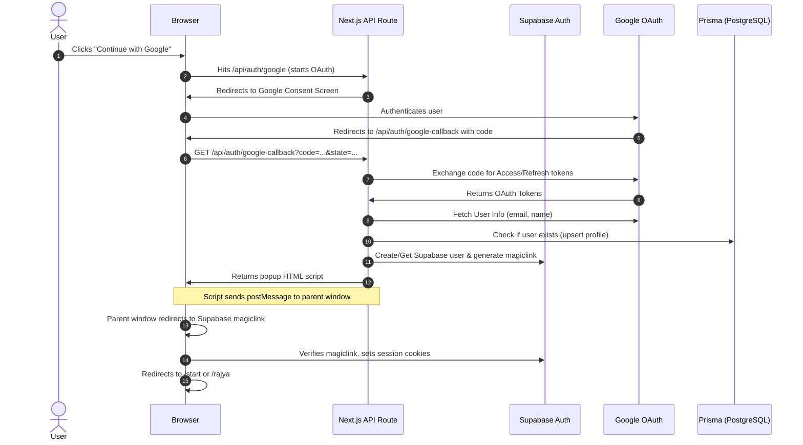

# Google Authentication Flow Audit

**Date**: 2026-07-18  
**Version**: 1.0  
**Status**: Confirmed  
**Lead Auditor**: AI Intern 1 (Codebase & Architecture Lead)

---

## 1. Google OAuth Flow Overview

The Svarajya application uses a dual auth structure: Supabase Auth for session handling and a custom Google OAuth callback handler that updates Prisma database profiles.

---

## 2. Step-by-Step Flow Details

1. **OAuth Initialisation**:
   - Location: `src/app/api/auth/google/route.ts`
   - Action: Constructs the Google OAuth authorization URL with scopes `userinfo.profile` and `userinfo.email`. It encodes user state (including `action` like `login` or `link`, `userId`, and `redirectTo`) in a Base64 string passed as the `state` parameter to prevent CSRF.
2. **Google Authentication & Redirect**:
   - Google authenticates the user and redirects back to the callback route specified in Google Cloud console.
3. **Google Callback Handling**:
   - Location: `src/app/api/auth/google-callback/route.ts`
   - Actions:
     - Parses the `code` and `state`.
     - Exchanges the authorization code for Google access and refresh tokens.
     - Fetches user details (email and name) from `https://www.googleapis.com/oauth2/v2/userinfo`.
4. **Linking Flow vs. Login Flow**:
   - **Linking Flow (`action === 'link'`)**: Updates the existing user's record in Prisma with Google OAuth tokens (`googleLinked = true`, `googleAccessToken`, `googleRefreshToken`). Returns an HTML page that triggers a `postMessage` event (`google-auth-success`), reloads the parent window, and closes the popup window.
   - **Login/Signup Flow (`action === 'login'`)**:
     - Checks if a user already exists with that email in the Prisma database. If their `authProvider` is `EMAIL` (registered manually), the login is blocked to prevent account hijacking.
     - Checks if they exist in the Supabase authentication pool using `supabaseAdmin.auth.admin.listUsers()`.
     - If the user does not exist in Supabase, it creates them using `supabaseAdmin.auth.admin.createUser()` with `email_confirm: true`.
     - Upserts the user record in Prisma.
     - Generates a Supabase authentication link (magiclink) using `supabaseAdmin.auth.admin.generateLink()` of type `magiclink` targeting the redirect URL `/start`.
     - Returns an HTML loader that redirects the parent window to the magiclink redirect URL and closes the popup.
5. **Session Creation**:
   - The browser navigates to the Supabase magiclink, establishing the active session, setting session cookies, and redirecting the user to `/start?success=Google_Login` or `Google_Signup`.
6. **Onboarding / Redirection**:
   - The root layout (`src/app/layout.tsx`) mounts `OAuthFragmentHandler`, and the dashboard pages mount `AuthSync`. They detect the session state, verify if it is `isFirstLogin` by calling `/api/profile`, and route the user either to `/onboarding/intro` (if new) or `/rajya` (if returning).

---

## 3. Critical Failures & Architecture Gaps

### 3.1 Truncated Password Reset Token (Bug 2 Root Cause)
- **Problem**: When a user clicks the password recovery link sent by email, the entrypoint route is `/callback?type=recovery#access_token=...&refresh_token=...`.
- **Failure**: The `/callback` route is mapped to a server-side GET handler (`src/app/(auth)/callback/route.ts`). Standard web browsers do not transmit hash fragments (everything from `#` onwards) to the server. Consequently, `requestUrl.hash` inside the server-side callback is always empty (`""`). The callback route redirects to `/reset-password` without any token.
- **Outcome**: The `/reset-password` client-side page receives no tokens, triggering the "Invalid or missing reset token" error. However, because the browser visited the Supabase recovery link, a session cookie was established. When the user browses the app, they are automatically logged in and redirected to `/rajya` without ever updating their password.
- **File Reference**: [callback/route.ts](file:///c:/Users/avira/Downloads/Svarajya-main%206-7-26/Svarajya-main/src/app/(auth)/callback/route.ts#L16-L23)

### 3.2 Duplicate OAuth Callback Entries
- **Problem**: The codebase contains duplicate paths for authentication callback logic.
- **Details**:
  - `/callback` maps to `src/app/(auth)/callback/route.ts` (handles email signup/recovery)
  - `/api/auth/google-callback` maps to `src/app/api/auth/google-callback/route.ts` (handles Google login/linking)
- **Risk**: Maintaining separate logic flows for oauth callback redirects makes state validation inconsistent and increases the likelihood of URL mismatch issues.

### 3.3 Hardcoded localhost Redirection Gaps
- **Problem**: The redirection mechanism falls back to local URLs if environment variables are not set.
- **Evidence**:
  - `src/app/api/auth/google-callback/route.ts#L71`: Defaults redirect URI to `https://svarajya.com/api/auth/google-callback` but falls back to `process.env.NEXT_PUBLIC_SITE_URL`.
  - If mismatch occurs between Google Cloud Console credentials and local environment configuration, OAuth will fail with `redirect_uri_mismatch`.

### 3.4 Missing Redirect URL validation (CSRF Risk)
- **Problem**: The `redirectTo` parameter passed during Google OAuth starts is read from Google callback state and redirected directly without domain whitelist checks.
- **Risk**: An attacker could manipulate the `state` parameter to redirect users to malicious external domains after login.

---

## 4. Recommended Fixes (No Code Changes Performed)
1. **Client-Side Callback Hook**: Route password recovery links directly to a client-side page `/reset-password` or use a client-side component (similar to `OAuthFragmentHandler`) to extract the hash before invoking API logic.
2. **Consolidate Callback Logic**: Merge the `/callback` and `/api/auth/google-callback` logic into a single middleware or callback router to maintain consistent session checks.
