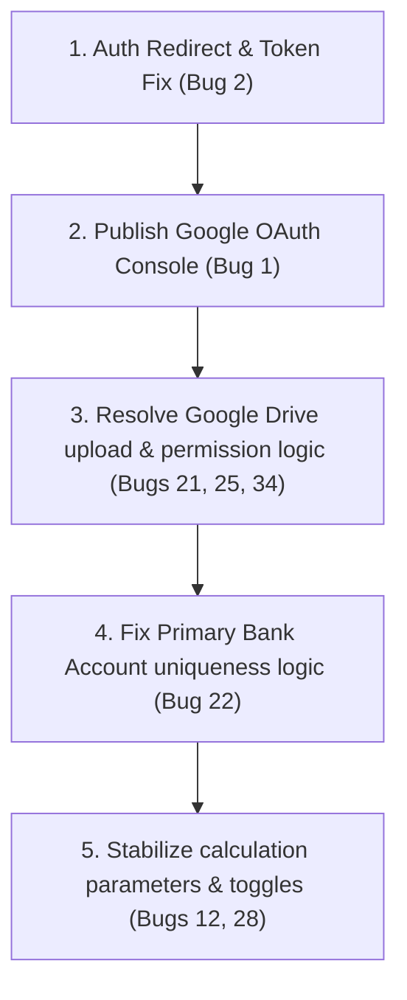

# P0 & P1 Bug Impact Report

**Date**: 2026-07-18  
**Version**: 1.0  
**Status**: Confirmed  
**Lead Auditor**: AI Intern 3 (Bug, QA & Handover Lead)

---

## 1. Overview
This report details the operational, financial, and security impacts of critical-severity bugs (P0/P1) discovered in the Svarajya application. We outline blocked user journeys, risks of data loss, and suggest a logical order for technical investigation.

---

## 2. Critical Bug Diagnostics

### 2.1 Bug 1: Google login restricted to test users only (P1)
- **Immediate Affected Module**: Authentication / Sign Up
- **Security / Access Risk**: High block risk. Regular customers attempting to log in or register via Google are met with Google Cloud consent warnings and authorization errors. The application cannot scale or support public signups.
- **Root Cause**: The Google Cloud OAuth consent screen is configured in "Testing" mode. 
- **User Journey Blocked**: Complete user onboarding and entry for all non-developer users.

### 2.2 Bug 2: Password reset link redirects to dashboard without changing password (P1)
- **Immediate Affected Module**: Authentication / Password Recovery
- **Security / Access Risk**: Critical security flaw. When a user requests a recovery link, they are automatically logged into the application (cookies/session created in background) but redirected to `/reset-password` *without* the URL token hash fragment. The user cannot update their password, and they are left in an active login state on a broken page.
- **Root Cause**: The server-side `/callback` route-handler does not receive URL hashes (as they are client-side only). It redirects user context via `NextResponse.redirect`, dropping the token parameter completely.
- **User Journey Blocked**: Password recovery, account lock restoration.

### 2.3 Bugs 21, 25, 34: Uploaded documents return "File does not exist" in Drive (P1)
- **Immediate Affected Module**: Document Vault (Pehchaan, Raksha, Rin, Kar)
- **Security / Access Risk**: High data-loss risk. Users upload policies, loan sanctions, and ITR slips hoping they are securely archived. When they click to view them, the system returns a file-not-found error, indicating the link references are corrupted or Drive permissions are broken.
- **Root Cause**: The Google Drive API client in `src/lib/googleDriveUtils.ts` registers file uploads but either fails to set access permissions or maps mismatched document folder references in the `document_meta` table.
- **User Journey Blocked**: Accessing and downloading saved certificates, KYC documents, and policy papers.

---

## 3. Recommended Investigation & Stabilization Sequence
We recommend fixing authentication and file-loss vulnerabilities first, followed by database anomalies:

