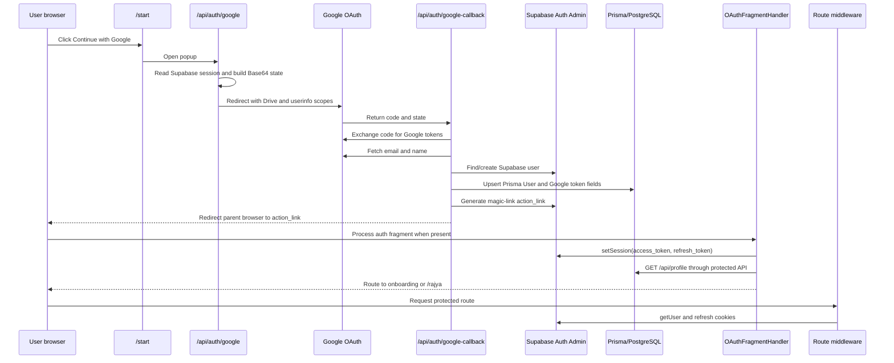

# Google Authentication Code Flow

**Scope:** Offline code trace only  
**Runtime execution:** Not performed  
**External configuration:** Not inspected  

## Confidence scale

- **Confirmed:** The step is explicit in source code.
- **Strong Evidence:** The local code strongly supports the step, but runtime configuration is needed to prove the result.
- **Probable:** The flow relies on expected provider behavior not completed explicitly in the snapshot.
- **Unconfirmed:** Required runtime or platform evidence is missing.

## Entry points

| User action | Entry path | Component/function | Confidence | Evidence |
|---|---|---|---|---|
| Open login | `/login` | `LoginRedirect` | Confirmed | `src/app/(landing)/login/page.tsx` redirects to `/start` |
| Open registration | `/register` | `RegisterRedirect` | Confirmed | `src/app/(landing)/register/page.tsx` redirects to `/start` |
| Email/password login | `/start` | start page default component submit handler | Confirmed | `src/app/(auth)/start/page.tsx` calls `supabase.auth.signInWithPassword()` |
| Google login | `/start` | `handleGoogleLogin()` | Confirmed | `src/app/(auth)/start/page.tsx` opens `/api/auth/google` in a popup |
| Link Google Drive/account | `/api/auth/link-google` or authenticated `/api/auth/google` | route `GET()` | Confirmed | `src/app/api/auth/link-google/route.ts`; `src/app/api/auth/google/route.ts` |

## Google login sequence



The final action-link-to-fragment transition is **Probable**, not fully confirmed: the callback redirects the browser to a Supabase-generated `action_link`, while `OAuthFragmentHandler` only establishes a session when the resulting URL contains `#access_token` and `refresh_token`. Redirect configuration and the exact generated link behavior were not available locally.

## Detailed trace

### 1. Login screen and Google request

`handleGoogleLogin()` in `src/app/(auth)/start/page.tsx` opens a popup at `/api/auth/google`.

The `GET()` handler in `src/app/api/auth/google/route.ts`:

1. Creates the cookie-aware server Supabase client from `src/lib/supabase/server.ts`.
2. Calls `supabase.auth.getSession()`.
3. Creates a state payload:
   - authenticated session: `{ userId, action: "link" }`
   - no session: `{ action: "login" }`
4. Base64-encodes the JSON state.
5. Requests Google scopes for `drive.file`, `userinfo.email`, and `userinfo.profile`.
6. Redirects to Google's OAuth authorization endpoint with `access_type=offline` and `prompt=consent`.

**Confidence:** Confirmed.  
**Evidence:** `src/app/(auth)/start/page.tsx` `handleGoogleLogin`; `src/app/api/auth/google/route.ts` `GET`.

### 2. Google callback and token exchange

`GET()` in `src/app/api/auth/google-callback/route.ts`:

1. Requires `code` and `state` query parameters.
2. Decodes the Base64 state and chooses `action`, `userId`, and `redirectTo`.
3. Exchanges the authorization code at Google's token endpoint using `GOOGLE_CLIENT_ID`, `GOOGLE_CLIENT_SECRET`, and `GOOGLE_REDIRECT_URI`.
4. Fetches the Google user's email and name from the Google userinfo endpoint.

**Confidence:** Confirmed as code path; provider response and environment values are Unconfirmed.  
**Evidence:** `src/app/api/auth/google-callback/route.ts` lines 44-112.

### 3. Google login user creation and profile creation

For `action === "login"`, the callback:

1. Queries Prisma by email and rejects Google login when an existing record has `authProvider === "EMAIL"`.
2. Calls `supabaseAdmin.auth.admin.listUsers()` and searches the returned list by email.
3. Calls `supabaseAdmin.auth.admin.createUser()` when no Supabase user exists.
4. Calls `prisma.user.upsert()` using the Supabase user ID.
5. Writes `googleLinked`, `googleAccessToken`, `googleRefreshToken`, and `googleTokenExpiry`; new rows also get `authProvider: "GOOGLE"`.
6. Calls `supabaseAdmin.auth.admin.generateLink({ type: "magiclink" })`.
7. Redirects the parent browser to the generated action link.

This is the primary Google profile-creation path.

**Confidence:** Confirmed.  
**Evidence:** `src/app/api/auth/google-callback/route.ts` lines 168-295; fields declared in `prisma/schema.prisma` lines 620-653.

There are two additional Prisma-user synchronization paths:

- `withAuth()` in `src/lib/middleware/auth.middleware.ts` creates a Prisma User when a valid Supabase user has no matching row.
- Email signup on `/start` calls the unauthenticated `POST /api/auth/create-user`, implemented in `src/app/api/auth/create-user/route.ts`, after confirmation-link generation.

**Confidence:** Confirmed.

### 4. Browser session creation

The Google callback does not call `signInWithOAuth()`, `exchangeCodeForSession()`, or `setSession()` directly. Instead it generates a Supabase magic link and sends the browser to `action_link`.

`OAuthFragmentHandler`, mounted globally by `src/app/layout.tsx`, checks every browser URL for `#access_token` and `refresh_token`. For a non-recovery fragment it calls:

```text
supabase.auth.setSession({ access_token, refresh_token })
```

It then requests `/api/profile` and routes first-login users to `/onboarding/intro`; others go to `/rajya`.

**Code behavior confidence:** Confirmed.  
**End-to-end session confidence:** Probable / Needs WD Verification because no live redirect configuration or runtime trace was supplied.  
**Evidence:** `src/components/auth/OAuthFragmentHandler.tsx`; provider mounting in `src/app/layout.tsx`.

### 5. Session restoration

Two mechanisms restore or verify sessions:

- `AuthProvider` calls `supabase.auth.getSession()` on mount and subscribes with `supabase.auth.onAuthStateChange()`.
- `updateSession()` in `src/lib/supabase/middleware.ts` creates a cookie-aware server client, calls `supabase.auth.getUser()`, and forwards refreshed cookies in the response.

`AuthSync` also calls `getSession()` outside its bypass/protected-prefix cases and then uses `/api/profile` to choose onboarding or Rajya.

**Confidence:** Confirmed.  
**Evidence:** `src/components/providers/AuthProvider.tsx`; `src/lib/supabase/middleware.ts`; `src/components/shared/AuthSync.tsx`.

### 6. Protected routes

`src/middleware.ts` delegates to `updateSession()` and matches all ordinary page requests except static assets and `/api/*`.

`updateSession()` considers marketing/auth paths public. When there is no Supabase user and the route is not public, it redirects to `/start?redirectTo=<original path>`. When a user visits `/start` or `/login`, it normally redirects to `/rajya`.

API routes are excluded from this matcher. Protected API handlers therefore rely on `withAuth()`/`getAuthContext()` or their own Supabase session checks.

**Confidence:** Confirmed.  
**Evidence:** `src/middleware.ts`; `src/lib/supabase/middleware.ts`; `src/lib/middleware/auth.middleware.ts`.

### 7. Profile routing after login

After email/password `signInWithPassword()`, `/start` requests `/api/profile`. If `isFirstLogin` is true it routes to `/onboarding/intro`; otherwise it routes to `/rajya`.

After `OAuthFragmentHandler.setSession()`, the same `/api/profile` decision is used. `GET /api/profile` uses `withAuth(AuthLevel.AUTHENTICATED)`, loads `userService.getUserWithProfile()`, and can call `syncUserWithSupabase()` when the Prisma row is missing.

**Confidence:** Confirmed.  
**Evidence:** `src/app/(auth)/start/page.tsx` lines 471-559; `src/components/auth/OAuthFragmentHandler.tsx`; `src/app/api/profile/route.ts`.

### 8. Logout

The dashboard provides several logout implementations:

- `BottomNav.handleLogout()` calls `supabase.auth.signOut()`, resets/clears client stores, and hard-redirects to `/start`.
- `DesktopSidebar.handleLogout()` calls `signOut()`, resets onboarding state, clears a login key, and redirects to `/start`.
- `GlobalTopRightMenu.handleLogout()` calls `signOut()`, clears several local-storage keys, and redirects to `/start`.
- `AuthProvider.signOut()` exposes a context-level sign-out call without navigation.

**Confidence:** Confirmed.  
**Evidence:** `src/components/layouts/BottomNav.tsx`; `DesktopSidebar.tsx`; `src/components/shared/GlobalTopRightMenu.tsx`; `src/components/providers/AuthProvider.tsx`.

## Separate Google account-linking flow

When a Supabase session already exists, `/api/auth/google` chooses `action: "link"`. `/api/auth/link-google` is a second explicit link entry point and adds `redirectTo` to state.

In the callback's link branch, the decoded `userId` is used by `prisma.user.update()` to store Google access/refresh tokens and mark `googleLinked=true`. The popup sends `google-auth-success` to the opener and reloads it. This branch does not create a new Supabase login session.

**Confidence:** Confirmed.  
**Evidence:** `src/app/api/auth/google/route.ts`; `src/app/api/auth/link-google/route.ts`; `src/app/api/auth/google-callback/route.ts` lines 54-167.

## Verification gaps

| Gap | Status | Required verification |
|---|---|---|
| Exact Google redirect URI active in production | Unconfirmed | WD/platform owner must compare Google OAuth configuration to `GOOGLE_REDIRECT_URI` |
| Exact Supabase magic-link redirect result | Needs WD Verification | Capture sanitized browser/network trace showing action link, resulting URL shape, and session cookie creation |
| Whether Google login succeeds for new and returning users | Needs WD Verification | Manual tests with dummy accounts only |
| Cookie flags and domain behavior | Unconfirmed | Inspect sanitized response headers/configuration without sharing values |
| OAuth state/CSRF protection behavior | Confirmed weakness in code; exploitability needs WD verification | Security review of unsigned Base64 state and callback ownership checks |
| Logout consistency across desktop/mobile/shared menus | Needs WD Verification | Verify session cookie removal, local state removal, and protected-route redirect |

No credentials, live tokens, or external calls were used for this trace.
